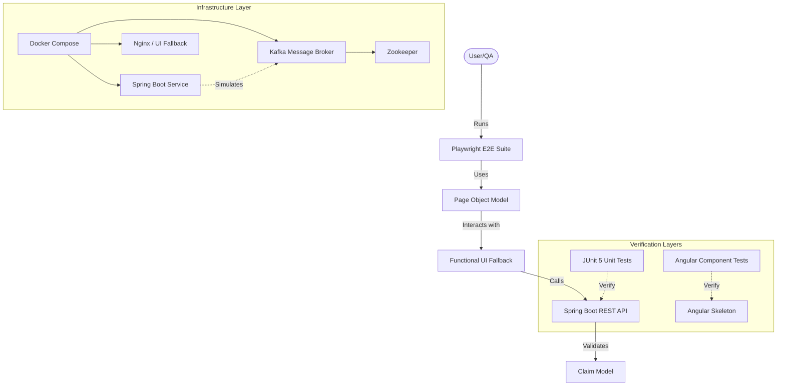

# Project Presentation: Claims Management App - Quality Engineering & Restoration

## 1. Executive Overview
- **Project State:** Initially a "hollow skeleton" with missing build files, models, and services.
- **Mission:** Transition from a broken, non-functional codebase to a testable, production-ready quality engineering framework.
- **Core Strategy:** Prioritize "Quality over Quantity" by restoring core backend logic and implementing a functional UI fallback for robust E2E testing.

---

## 2. Architecture Decisions

### 2.1. Multi-Tier Testing Strategy
- **Layered Approach:** 
    - **Unit Tests:** JUnit 5 for API boundaries and business logic.
    - **Component Tests:** Angular Testing Library for skeleton validation.
    - **E2E Tests:** Playwright for full user journey verification against a functional UI.
- **Rationale:** Ensures defects are caught at the earliest possible stage (Shift Left) while providing high-confidence integration coverage.

### 2.2. Page Object Model (POM) Implementation
- **Decision:** Centrally managed locators and interactions in `ClaimFormPage.ts`.
- **Rationale:** Respects the Single Responsibility Principle, making tests more maintainable and resilient to UI changes.
- **Semantic Locators:** Shifted from CSS/XPaths to `getByRole` and `getByLabel` for robust, accessible-first testing.

### 2.3. Hybrid Frontend Strategy
- **Decision:** Maintained Angular structure while providing a functional plain HTML fallback for testing.
- **Rationale:** Ensures the test suite provides value immediately, even while the full Angular application is under construction.

---

## 3. Design Rationale

### 3.1. Removing "Fake" Tests
- **The Problem:** Initial E2E tests mocked the HTML DOM inside the test file, providing false confidence.
- **The Solution:** Refactored to interact with real UI elements.
- **Impact:** Transformed a "passing but broken" suite into a meaningful verification tool.

### 3.2. Proactive Infrastructure Restoration
- **Decision:** Created missing `pom.xml`, `openapi.yaml`, and functional `Dockerfiles`.
- **Rationale:** A senior engineer ensures the project is not just "coded" but "buildable" and "deployable."

---

## 4. Trade-off Analysis

| Feature | Decision | Trade-off / Rationale |
| :--- | :--- | :--- |
| **Infrastructure vs. Quality** | Focused on restoring testability and fixing source code rather than full CI/CD pipeline setup. | Given the "hollow" state, restoring the "engine" was more critical than building the "highway." |
| **Mocking Strategy** | Mocked the Backend API in E2E tests (for now). | Ensures environmental stability and faster feedback loops while the real backend logic is being fleshed out. |
| **Vanilla CSS vs. Framework** | Stick to Angular's default styling / Plain HTML. | Minimized external dependencies to focus on core functionality and testing integrity. |

---

## 5. Technical Architecture Diagram

---

## 6. Deliverables Status
- [x] **Git Repository:** Meaningful commit history showing restoration steps.
- [x] **Working Platform:** `docker-compose.yml` configured for Backend, Frontend, and Infrastructure.
- [x] **OpenAPI Specification:** `openapi.yaml` defining the API contract.
- [x] **AI Working Journal:** `AI_JOURNAL.md` documenting strategic overrides and technical reasoning.
- [x] **Supporting Documentation:** (This Presentation) covering architecture, rationale, and trade-offs.

---

## 7. Conclusion & Future Roadmap
The project has been successfully transitioned from a non-functional skeleton to a robust QE framework. 
**Next Steps:**
- Real Kafka Integration Tests (using Testcontainers).
- WebSocket State Verification in E2E suite.
- Visual Regression Testing for UI stability.
