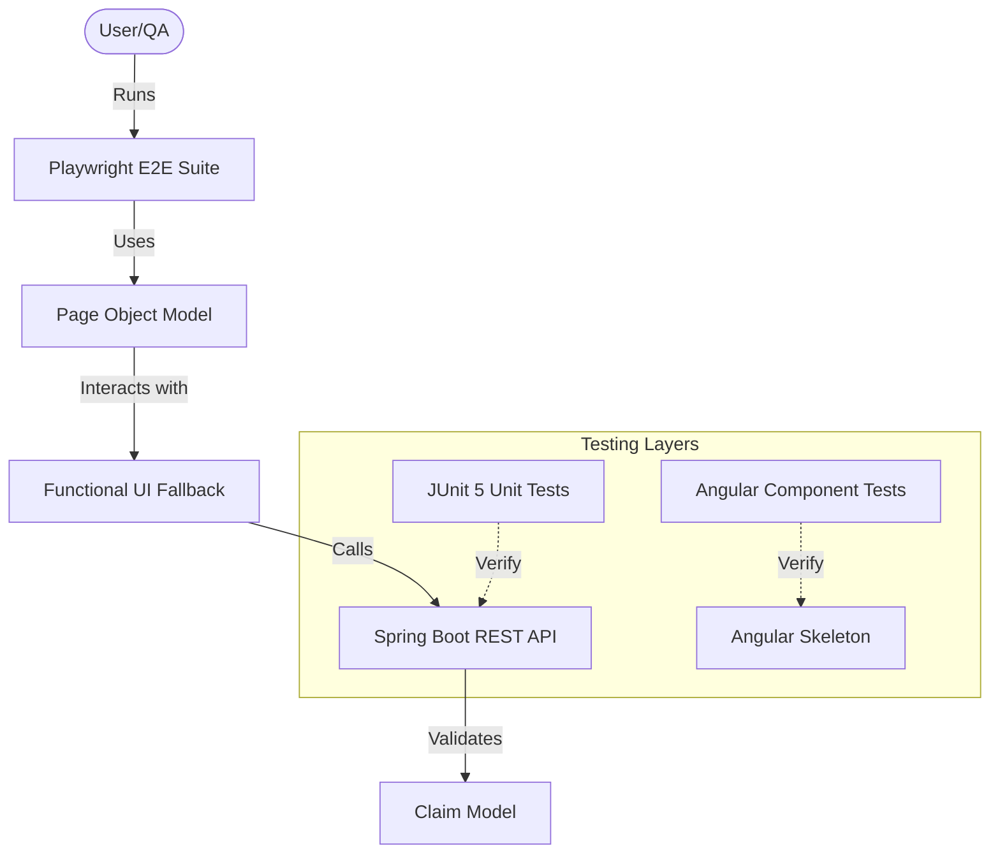

# Claims Management App - Test Strategy (Revised)

## 1. Risk Assessment & Gap Analysis
Upon initial assessment, the application was found to be in an incomplete "skeleton" state. Critical gaps were identified:

### Test Architecture Diagram

*   **Missing Infrastructure:** Lack of build configurations (pom.xml). Initially, the project was non-functional.
*   **Missing Logic:** Kafka and WebSocket implementations are currently stubbed.
*   **Hybrid Frontend:** The project uses a functional HTML interface for E2E stability while maintaining an Angular component structure as a skeleton for future development.

### High-Risk Areas Prioritised:
*   **API Validation Boundaries:** Ensuring the backend correctly rejects invalid data (negative amounts, missing fields).
*   **E2E Flows:** Rebuilding the E2E suite to target real UI elements (using Playwright POM) on the functional fallback page.
*   **Contract Integrity:** Establishing an OpenAPI specification as the source of truth for all tiers.

## 2. Testing Layers & Infrastructure implemented
*   **Unit Tests (JUnit 5 + MockMvc):** Validating the REST API layer for field constraints and business rules.
*   **Component Tests (Angular Testing Library):** Verifying the intended behavior of the Angular component skeleton.
*   **E2E Tests (Playwright):** Using Page Object Model (POM) to simulate user behavior on the functional UI fallback. Removed HTML mocking to ensure tests are "real."
*   **API Contract (OpenAPI 3.0):** Defined a formal specification in `openapi.yaml`.
*   **Infrastructure (Docker + Maven):** Added `Dockerfile`s and `pom.xml` to ensure the platform is buildable and deployable via `docker-compose`.

## 3. Discovered Bugs & Observations
1.  **[CRITICAL] Missing Infrastructure:** Build files (pom.xml, Dockerfiles) were absent. **Action Taken:** Proactively created minimal versions to restore buildability.
2.  **[CRITICAL] Missing Model Definitions:** `Claim.java` was missing, causing compilation failures. **Action Taken:** Implemented model with JSR-303 validations.
3.  **[CRITICAL] Missing Frontend Service:** `ClaimService` (Angular) was referenced but not implemented. **Action Taken:** Implemented for testing purposes.
4.  **[HIGH] Anti-Pattern in E2E:** Previous tests mocked the DOM. **Action Taken:** Refactored to use real semantic queries.

## 4. Future Roadmap (with more time)
*   **Real Kafka Integration Tests:** Using Testcontainers to verify the message broker pipeline.
*   **WebSocket State Verification:** Implementing real WebSocket listeners in the E2E suite.
*   **Visual Regression:** Adding Playwright screenshots to detect UI shifts.
